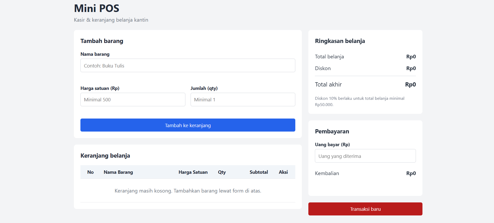
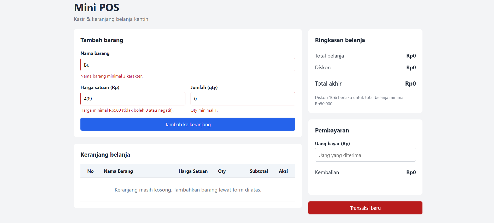
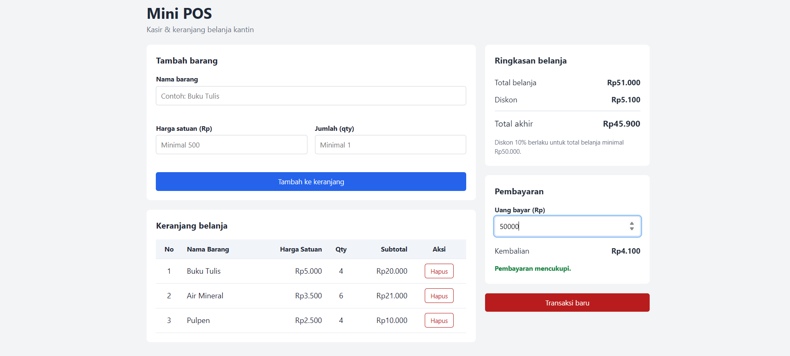

# Mini POS - Kasir & Keranjang Belanja Sederhana

## Identitas

- **Nama Lengkap:** Jundi Lamtara
- **NIM:** 124140190
- **Program Studi:** Teknik Informatika
- **Kelas Praktikum:** Pengembangan Aplikasi Web RB

## Deskripsi Aplikasi

Mini POS adalah aplikasi web kasir sederhana untuk kantin atau toko kampus. Kasir memasukkan barang yang dibeli ke keranjang, aplikasi menghitung total belanja, diskon, dan kembalian secara otomatis, dan isi keranjang tetap tersimpan walaupun halaman di-refresh.

**Tujuan pembuatan:** menyatukan tiga kompetensi dasar praktikum dalam satu aplikasi, yaitu validasi input form, perhitungan kalkulator otomatis, dan manajemen keranjang belanja berbasis `localStorage`.

**Studi kasus:** kasir kantin atau toko kampus. Contoh barang yang dipakai: Buku Tulis, Air Mineral, dan Pulpen.

Aplikasi dibuat dengan HTML, CSS, dan JavaScript murni tanpa library tambahan.

## Panduan Menjalankan

**Dengan Live Server di VS Code (disarankan)**

1. Ekstrak file zip, lalu pastikan `index.html`, `style.css`, dan `script.js` berada dalam satu folder.
2. Buka folder hasil ekstrak tersebut di VS Code (**File > Open Folder**).
3. Pasang ekstensi **Live Server** dari menu Extensions jika belum ada.
4. Klik kanan `index.html`, lalu pilih **Open with Live Server**.
5. Browser terbuka otomatis di alamat `http://127.0.0.1:5500/`.

**Tanpa Live Server**

1. Ekstrak file zip, lalu buka folder hasil ekstrak di File Explorer.
2. Klik dua kali `index.html` di folder utama. Halaman terbuka langsung di browser dan semua fitur tetap berjalan.

## Daftar Fitur

**Validasi form input barang**

- [x] Nama barang wajib diisi, minimal 3 karakter
- [x] Harga satuan wajib angka bulat, minimal Rp500 (tidak boleh kosong, 0, atau negatif)
- [x] Qty wajib angka bulat, minimal 1
- [x] Pesan error berwarna merah muncul di bawah input yang salah
- [x] Input yang salah diberi border merah dan fokus otomatis pindah ke input tersebut
- [x] Barang tidak masuk keranjang jika ada input yang tidak valid
- [x] Form otomatis di-reset setelah barang berhasil ditambahkan

**Kalkulator dan perhitungan otomatis**

- [x] Subtotal per barang = harga satuan x qty
- [x] Total belanja = jumlah seluruh subtotal
- [x] Diskon 10% otomatis jika total belanja minimal Rp50.000
- [x] Nominal diskon dan total akhir ditampilkan
- [x] Input uang bayar dengan kembalian otomatis (kembalian = uang bayar - total akhir)
- [x] Keterangan "Uang belum mencukupi" beserta jumlah kekurangannya
- [x] Format Rupiah pada semua angka (contoh: Rp45.900)

**Keranjang belanja dan localStorage**

- [x] Tabel keranjang dengan kolom No, Nama Barang, Harga Satuan, Qty, Subtotal, dan Aksi
- [x] Tombol Hapus di setiap baris, total dan diskon langsung dihitung ulang
- [x] Keranjang disimpan dengan `JSON.stringify()` dan dimuat dengan `JSON.parse()`
- [x] Isi keranjang tidak hilang saat halaman di-refresh
- [x] Tombol Transaksi baru mengosongkan keranjang dan menghapus data di `localStorage`
- [x] Tampilan responsif untuk layar desktop dan HP

## Tangkapan Layar

**1. Tampilan form input utama**



**2. Tampilan saat validasi error muncul**

Contoh input: nama "Bu" (kurang dari 3 karakter), harga 499 (di bawah Rp500), dan qty 0.



**3. Tampilan hasil perhitungan kalkulator dan tabel keranjang**

Contoh: total belanja Rp51.000 mendapat diskon Rp5.100 sehingga total akhir Rp45.900. Dengan uang bayar Rp50.000, kembaliannya Rp4.100.



## Penjelasan Teknis Singkat

### Struktur file

- `index.html`: struktur halaman Mini POS (form, tabel keranjang, ringkasan, pembayaran).
- `style.css`: tampilan dan tata letak responsif.
- `script.js`: seluruh logika aplikasi.
- `images/`: tangkapan layar yang dipakai di README ini.
- `modul/`: jawaban latihan JavaScript (Variabel-Kondisional, Loop-Fungsi, Array-Objek, DOM-API).

Aturan yang sering berubah disimpan sebagai konstanta di bagian atas `script.js`: `MIN_NAMA`, `MIN_HARGA`, `MIN_QTY`, `MIN_BELANJA_DISKON`, dan `PERSEN_DISKON`.

### 1. Penanganan validasi input

Saat form dikirim (event `submit`), `event.preventDefault()` mencegah halaman dimuat ulang. Fungsi `validasiForm()` kemudian memeriksa tiga input satu per satu dan mengembalikan objek berisi pesan error per input. Pesan kosong berarti input tersebut valid.

```js
const pesan = validasiForm();   // { nama: "", harga: "", qty: "" }
tampilkanError(pesan);          // tulis pesan merah + border merah
```

- **Nama:** hasil `trim()` tidak boleh kosong dan panjangnya minimal 3 karakter.
- **Harga:** teks diubah dengan `Number()`, harus berupa angka, minimal 500, dan bilangan bulat (`Number.isInteger`).
- **Qty:** harus berupa angka, bilangan bulat, dan minimal 1.

Jika salah satu pesan tidak kosong, proses dihentikan dengan `return` sehingga barang tidak masuk keranjang, dan fokus dipindahkan ke input yang salah. Jika semua valid, barang ditambahkan ke array `keranjang`, disimpan, ditampilkan, lalu form di-reset dengan `formBarang.reset()`.

### 2. Algoritma kalkulator keuangan

Semua angka dihitung dari isi array `keranjang` oleh satu fungsi, `hitungRingkasan()`, supaya hasilnya selalu konsisten:

```
subtotal    = harga x qty              (per barang)
total       = jumlah semua subtotal
diskon      = total >= 50.000 ? round(total x 10 / 100) : 0
total akhir = total - diskon
kembalian   = uang bayar - total akhir
```

Fungsi `hitungKembalian()` membandingkan uang bayar dengan total akhir:

- uang bayar kosong: tidak ada keterangan,
- keranjang kosong: tampil "Keranjang masih kosong",
- uang bayar kurang: tampil "Uang belum mencukupi, kurang Rp...",
- uang bayar cukup: kembalian dihitung dan tampil "Pembayaran mencukupi".

Perhitungan dijalankan ulang setiap kali keranjang berubah (tambah, hapus, reset) dan setiap kali kasir mengetik di kolom uang bayar (event `input`).

### 3. Mekanisme serialisasi localStorage

`localStorage` hanya bisa menyimpan teks, sehingga array keranjang harus diubah menjadi string JSON lebih dulu.

- **Menyimpan (serialisasi):** setiap kali keranjang berubah, `simpanKeranjang()` memanggil `localStorage.setItem("keranjang", JSON.stringify(keranjang))`.
- **Memuat (deserialisasi):** saat halaman dibuka, `muatKeranjang()` memanggil `JSON.parse(localStorage.getItem("keranjang"))` di dalam `try/catch`. Jika data kosong atau rusak, hasilnya keranjang kosong sehingga aplikasi tidak error. Setiap item juga diperiksa bentuknya sebelum dipakai.
- **Menghapus:** tombol Transaksi baru memanggil `localStorage.removeItem("keranjang")` dan mengosongkan array `keranjang`.

Contoh data yang tersimpan:

```json
[{"nama":"Buku Tulis","harga":5000,"qty":4},{"nama":"Pulpen","harga":2500,"qty":4}]
```

### Daftar fungsi di `script.js`

- `muatKeranjang()` dan `simpanKeranjang()`: baca dan tulis `localStorage`.
- `formatRupiah(angka)`: mengubah angka menjadi format Rupiah, misalnya `Rp50.000`.
- `hitungSubtotal(item)`: harga x qty satu barang.
- `hitungRingkasan()`: total belanja, diskon, dan total akhir.
- `hitungKembalian()`: kembalian dan status pembayaran.
- `tampilkanKeranjang()` dan `tampilkanRingkasan()`: memperbarui tampilan tabel dan angka ringkasan.
- `validasiForm()`, `tampilkanError()`, dan `bersihkanError()`: validasi dan pesan error.
- `hapusBarang(index)`: menghapus satu barang dari keranjang.

## Contoh Pengujian Manual

- **Validasi:** kosongkan semua input lalu klik Tambah. Tiga pesan merah muncul dan keranjang tidak berubah.
- **Batas harga:** harga 499 ditolak, harga 500 diterima.
- **Diskon:** total Rp49.000 tidak mendapat diskon, total Rp50.000 mendapat diskon Rp5.000 (total akhir Rp45.000).
- **Kembalian:** dengan total akhir Rp45.000, uang bayar 40000 menampilkan kurang Rp5.000, dan 50000 menampilkan kembalian Rp5.000.
- **Persisten:** tambah barang lalu refresh halaman. Isi keranjang tetap ada.
- **Reset:** klik Transaksi baru. Keranjang, uang bayar, dan data `localStorage` kosong.
